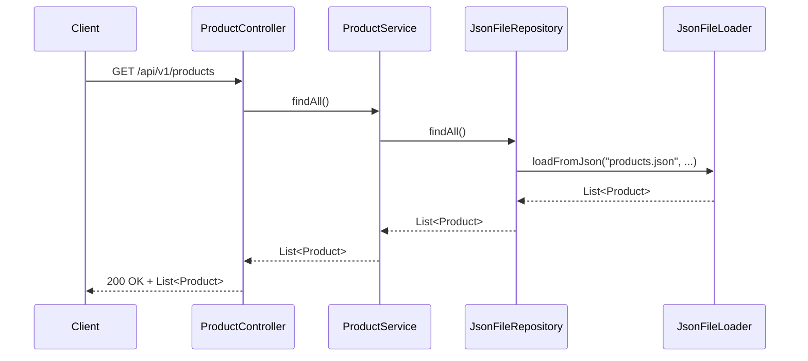
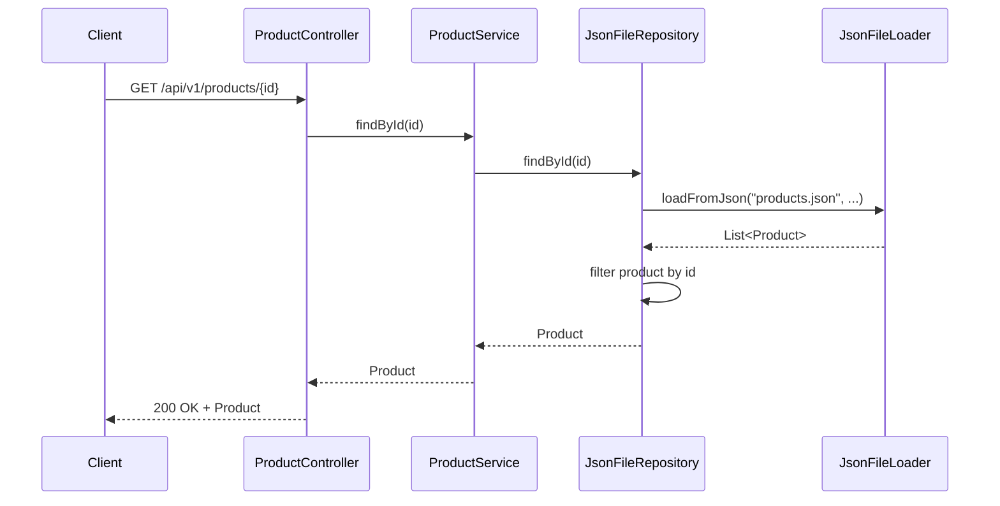

# Product Service - AGL MELI Microservice

Microservicio responsable de exponer una API REST para gestionar productos, basado en Spring Boot.

---

## 🚀 Descripción general

Este servicio ofrece endpoints para consultar productos. La información se obtiene mediante un repositorio que carga los datos desde archivos JSON, reutilizando la librería común (`common`) que contiene utilidades como `JsonFileLoader`.

---

## 📦 Componentes principales

### Controller

- `ProductController` expone dos endpoints REST:
    - `GET /api/v1/products` — Obtiene la lista completa de productos.
    - `GET /api/v1/products/{id}` — Obtiene un producto por su ID.

### Service

- `ProductService` contiene la lógica para recuperar productos desde el repositorio.

### Repository

- `JsonFileRepository` (implementación personalizada) carga los datos desde archivos JSON usando la clase `JsonFileLoader` de la librería común.

---

## 🔗 Flujo de llamada principal

### 1. Listar todos los productos (`GET /api/v1/products`)



### 2. Obtener producto por ID (GET /api/v1/products/{id})


## 🔧 Ejemplo de uso
Request para obtener todos los productos

```bash
  curl -X GET http://localhost:8080/api/v1/products
```
Request para obtener producto por ID
```bash
  curl -X GET http://localhost:8080/api/v1/products/123
```
## 📁 Estructura del proyecto
```css
product-service/
├── src/main/java/com/agl/meli/product/
│   ├── controller/
│   │   └── ProductController.java
│   ├── service/
│   │   └── ProductService.java
│   ├── repository/
│   │   └── JsonFileRepository.java
│   ├── model/
│   │   └── Product.java
│   └── dto/
│       └── ApiResponse.java
├── src/main/resources/
│   └── error_products.json
│   └── products.json
├── pom.xml
└── README.md
```

## 🛠️ Tecnologías y dependencias

- Java 17
- Spring Boot Web
- Librería común (common) con JsonFileLoader
- Jackson (JSON processing)

## 🧪 Tests

- Se incluyen tests unitarios para controladores y servicios.
- Se testea la correcta carga de productos desde JSON.

